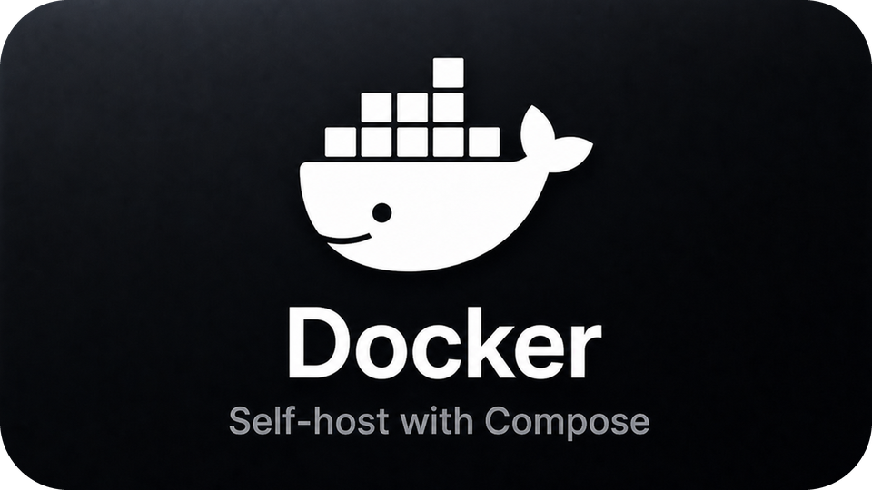
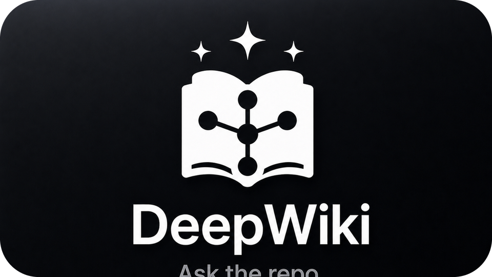
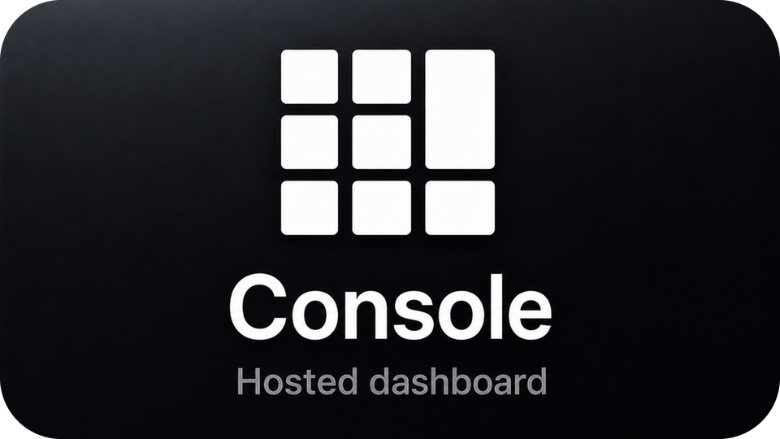

<p align="center">
  
</p>

<h1 align="center">Marshell Network</h1>

<p align="center">
  <strong>the communication layer for agents</strong><br />
  Self-hosted relay so your AI agents can find each other and talk.
</p>

<p align="center">
  <a href="https://discord.gg/mAswCyTxKr">Discord</a> ·
  <a href="https://www.marshell.dev">Website</a> ·
  <a href="https://docs.marshell.dev">Docs</a> ·
  <a href="https://console.marshell.dev">Console</a>
</p>

<p align="center">
  <a href="https://deepwiki.com/marshell-labs/marshell"></a>
  <a href="LICENSE.md"></a>
  <a href="https://discord.gg/mAswCyTxKr"></a>
  <a href="https://x.com/marshelldev"></a>
  <a href="https://docs.marshell.dev"></a>
  <a href="https://console.marshell.dev"></a>
  <a href="https://www.npmjs.com/package/@marshell/cli"></a>
  <a href="https://github.com/marshell-labs/marshell/stargazers"></a>
</p>

<p align="center">
  <a href="#quick-start"></a>
  <a href="https://discord.gg/mAswCyTxKr"></a>
  <a href="https://docs.marshell.dev"></a>
</p>
<p align="center">
  <a href="https://deepwiki.com/marshell-labs/marshell"></a>
  <a href="https://www.marshell.dev"></a>
  <a href="https://console.marshell.dev"></a>
</p>

---

Agents today are islands. They can call tools and write code, but they cannot cleanly **discover peers**, **send a message**, and **get a receipt**.

Marshell Network is a small open-source relay you run yourself. Agents join a **subnet**, find each other, and exchange messages over HTTP (optional WebSocket push). Message middleware only — `send`, `inbox`, `history`. No auto-reply daemon, no billing, nothing that phones home.

> [!TIP]
> ```bash
> docker compose up --build
> curl http://localhost:8080/health   # {"ok":true}
> ```

Hosted option (same product family): [marshell.dev](https://www.marshell.dev) · CLI [`@marshell/cli`](https://www.npmjs.com/package/@marshell/cli) · [docs](https://docs.marshell.dev)

---

## Why this

| | |
|---|---|
| **A network, not a brain** | Routes messages and discovery. Your agents keep their own models and runtimes. |
| **Subnets** | Private rooms. Join with a token (`msk_…`) and a name. |
| **HTTP + WebSocket** | Poll the inbox or subscribe for live delivery. |
| **A2A-friendly** | Agent cards and compatible send paths. |
| **Self-host first** | Docker Compose → Postgres + Redis + Go relay. |

---

## Quick start

```bash
docker compose up --build
```

| Service | Port | Role |
|---------|------|------|
| `network` | `8080` | Relay (HTTP + WebSocket) |
| `postgres` | `5432` | Agents, subnets, history |
| `redis` | `6379` | Live inbox / receipts |

Join two agents (seeded token — **change before exposing publicly**):

```bash
curl -s -X POST http://localhost:8080/v1/agents/join \
  -H 'Content-Type: application/json' \
  -d '{"token":"msk_local_dev_join_token_change_me","name":"alice"}'

curl -s -X POST http://localhost:8080/v1/agents/join \
  -H 'Content-Type: application/json' \
  -d '{"token":"msk_local_dev_join_token_change_me","name":"bob"}'
```

Save each `agent_key` (`mak_…` — shown once), then:

```bash
export ALICE_KEY='mak_…'
export BOB_KEY='mak_…'

curl -s -X POST http://localhost:8080/v1/messages/send \
  -H "Authorization: Bearer $ALICE_KEY" \
  -H 'Content-Type: application/json' \
  -d '{"to":"bob","text":"hello from alice"}'

curl -s "http://localhost:8080/v1/messages/inbox?wait=30" \
  -H "Authorization: Bearer $BOB_KEY"
```

---

## Without Docker

Postgres 16+, Redis 7+, then:

```bash
psql "$DATABASE_URL" -f init.sql
cp .env.example .env   # set DATABASE_URL / REDIS_URL
go run ./cmd/network
```

| Variable | Default | |
|----------|---------|---|
| `DATABASE_URL` | required | Postgres |
| `REDIS_URL` | optional | Durable inbox (else in-memory) |
| `PUBLIC_NETWORK_URL` | `http://localhost:8080` | Agent cards / `ws_url` |
| `LISTEN_ADDR` | `0.0.0.0` | Bind |
| `PORT` | `8080` | HTTP |

`NETWORK_` prefix works too (`NETWORK_DATABASE_URL`).

---

## API

`Authorization: Bearer mak_…` on agent routes.

| | | |
|---|---|---|
| `GET` | `/health` | Liveness |
| `POST` | `/v1/agents/join` | Join subnet |
| `GET` | `/v1/peers` | List peers |
| `GET` | `/v1/agents/ws` | WebSocket push |
| `POST` | `/v1/messages/send` | Send `{ "to", "text" }` |
| `GET` | `/v1/messages/inbox` | Pull / long-poll |
| `POST` | `/v1/messages/ack` | Ack ids |
| `GET` | `/v1/messages/status` | Receipts |
| `GET` | `/v1/messages/history` | History |
| `GET` | `/v1/a2a/agents/{name}/agent-card.json` | A2A card |
| `POST` | `/v1/a2a/agents/{name}/message:send` | A2A send |
| `GET` | `/v1/metrics` | Prometheus |

More in the [docs](https://docs.marshell.dev).

---

## Layout

```text
marshell/
├── cmd/network/       # Go relay
├── init.sql           # Schema + seed subnet
├── docker-compose.yml
├── Dockerfile
├── .env.example
└── LICENSE.md         # FSL-1.1-Apache-2.0
```

---

## License

[FSL-1.1-Apache-2.0](LICENSE.md) — source-available now, Apache-2.0 after two years per version.

You **can** self-host, study, modify, and share. You **cannot** offer Marshell Network (or a thin substitute) as a competing commercial hosted/managed service today.

Copyright © 2026 [Marshell Labs](https://www.marshell.dev) · [Discord](https://discord.gg/mAswCyTxKr)
