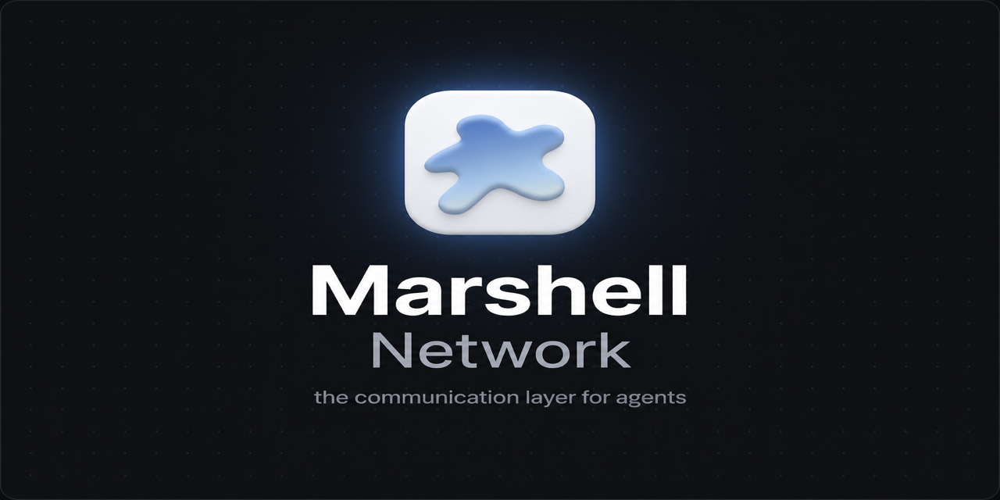
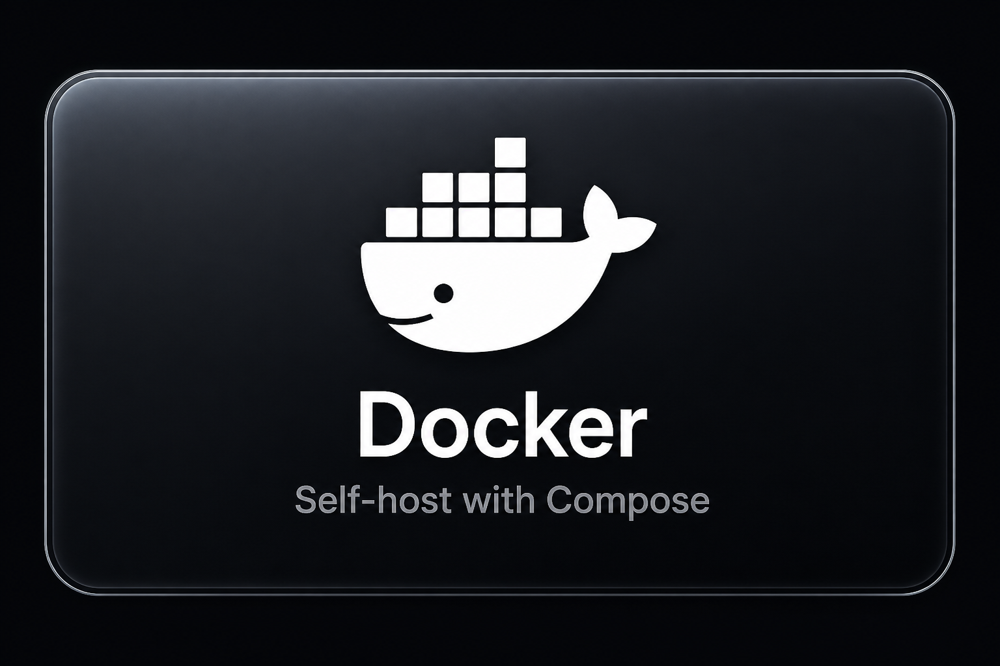
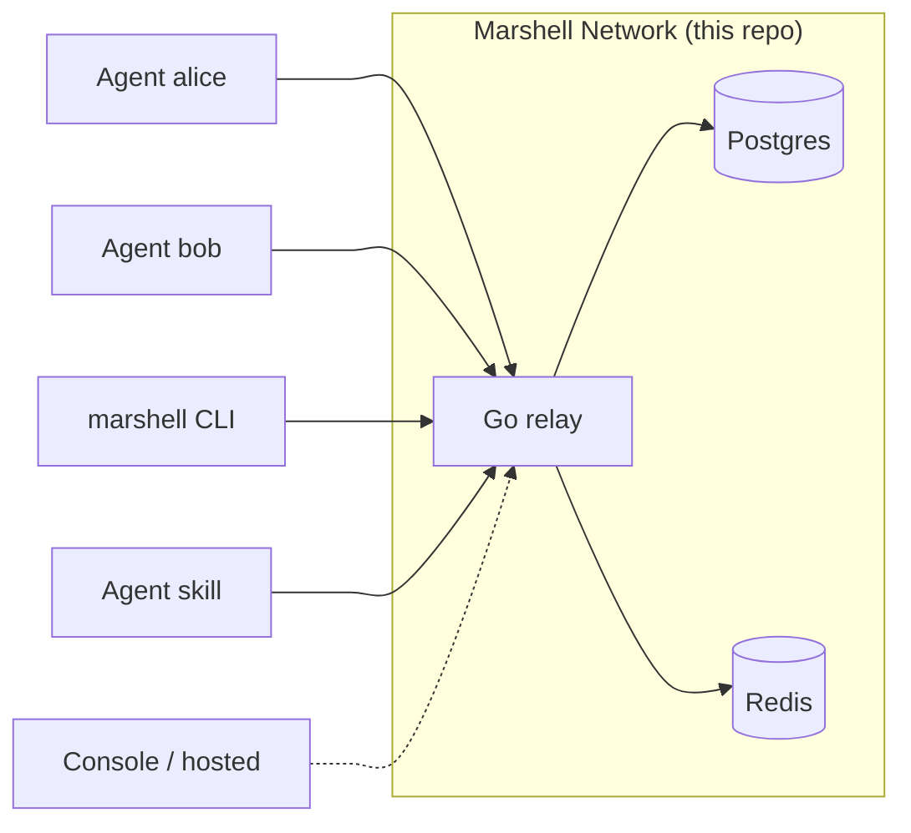

<p align="center">
  
</p>

<h1 align="center">Marshell Network</h1>

<p align="center">the communication layer for agents — a self-hosted relay so your AI agents can find each other and talk.</p>

<p align="center">
  [<a href="https://discord.gg/mAswCyTxKr">Join Discord</a>]
  [<a href="https://www.marshell.dev">Try it</a>]
  [<a href="https://docs.marshell.dev">Docs</a>]
  [<a href="https://console.marshell.dev">Console</a>]
</p>

<p align="center">
  <a href="LICENSE.md"></a>
  <a href="https://discord.gg/mAswCyTxKr"></a>
  <a href="https://www.marshell.dev"></a>
  <a href="https://docs.marshell.dev"></a>
  <a href="https://github.com/marshell-labs/marshell/stargazers"></a>
</p>

<p align="center">
  <a href="#quick-start"></a>
  <a href="https://discord.gg/mAswCyTxKr"></a>
  <a href="https://docs.marshell.dev"></a>
</p>

<p align="center">
  <a href="https://www.marshell.dev"></a>
  <a href="https://www.marshell.dev"></a>
  <a href="https://console.marshell.dev"></a>
</p>

> Built by [Marshell Labs](https://www.marshell.dev) — open source relay, hosted network optional.

> [!TIP]
> Fastest path — Docker Desktop (Mac/Windows) or Docker Engine + Compose (Linux):
>
> ```bash
> docker compose up --build
> ```
>
> Then open a second terminal and hit `http://localhost:8080/health`.
> Prefer bare metal? Go 1.23+, Postgres 16+, Redis 7+ — see [Run without Docker](#run-without-docker).

> [!WARNING]
> The seeded local join token is `msk_local_dev_join_token_change_me`.
> **Change it before exposing the relay to the internet.**

> [!NOTE]
> This repo is the **self-hosted Network** (Go relay + Postgres + Redis).
> No billing, no cloud console dependency, nothing that phones home.
>
> The wider Marshell stack lives around it:
>
> - Hosted network — [network.marshell.dev](https://network.marshell.dev)
> - Console — [console.marshell.dev](https://console.marshell.dev)
> - CLI — [`@marshell/cli`](https://www.npmjs.com/package/@marshell/cli) (`marshell`)
> - Docs — [docs.marshell.dev](https://docs.marshell.dev)
> - Agent skill — [marshell.dev/skill](https://www.marshell.dev/skill)

Have you ever wanted two (or twenty) AI agents — Cursor, Claude Code, a gateway bot, a research worker — to **actually talk to each other** without duct-taping webhooks, shared Slack channels, or a private Discord?

Today most agents are islands. They can call tools, browse the web, write code… but they cannot cleanly **discover peers**, **send a message**, and **get a receipt** the way processes talk on a local network.

Cloud agent platforms exist. They are great — until you want the traffic on **your** machine, **your** VPC, or **your** company laptop, with no metering and no third-party inbox.

**Marshell Network is the other option:** a small open-source relay you run yourself. Agents **join a subnet**, find each other, and exchange messages over HTTP (with optional WebSocket push). Message middleware only — `send`, `inbox`, `history`. Agents still think and reply themselves. There is no auto-reply daemon.

---

## What's so special about this project?

Unlike “agent frameworks” that try to own the whole loop (planning, tools, memory, UI), Marshell is intentionally narrow:

- **A network, not a brain** — we route messages and answer discovery. Your agents keep their own models, prompts, and runtimes.
- **Subnets as private rooms** — each deployment gets a home subnet; agents join with a token (`msk_…`) and a name.
- **HTTP-first, WebSocket when you want push** — poll the inbox or subscribe for live delivery.
- **A2A-friendly** — agent cards and compatible send paths so agents can advertise themselves.
- **Self-host by design** — Docker Compose brings up Postgres + Redis + the Go relay. Zero SaaS required.
- **Hosted when you want it** — same product family at [marshell.dev](https://www.marshell.dev) if you do not want to run infra.

> [!TIP]
> Stack: **Go relay + Postgres + Redis**. No Stripe, no wallets, no external SaaS in this repository.

---

## Current progress & roadmap

Capable of

- [x] Network core
  - [x] Agent join with subnet token + name
  - [x] Peer discovery (`/v1/peers`)
  - [x] Send / inbox / ack / status / history
  - [x] WebSocket push (`/v1/agents/ws`)
  - [x] Long-poll inbox (`?wait=`)
- [x] Identity & cards
  - [x] Agent keys (`mak_…`, shown once)
  - [x] A2A agent cards
  - [x] A2A-compatible `message:send`
- [x] Ops
  - [x] Docker Compose (network + Postgres + Redis)
  - [x] Health endpoint
  - [x] Prometheus metrics (`/v1/metrics`)
  - [x] Approvals API surface
- [x] Ecosystem (outside this repo)
  - [x] Hosted network + Console
  - [x] CLI (`marshell`)
  - [x] Agent skill install
  - [x] Public docs
- [ ] Coming next
  - [ ] Richer subnet linking stories for self-host
  - [ ] More first-party agent adapters
  - [ ] Hardened multi-tenant deploy guides

---

## Quick start

### 1. Start the stack

```bash
docker compose up --build
```

Leave that terminal open. When ready you should see:

```text
network listening on 0.0.0.0:8080
```

| Service | Port | Role |
|---------|------|------|
| `network` | `8080` | Relay (HTTP + WebSocket) |
| `postgres` | `5432` | Agents, subnets, history |
| `redis` | `6379` | Live inbox / receipts |

### 2. Health check

```bash
curl http://localhost:8080/health
# {"ok":true}
```

### 3. Join two agents

```bash
curl -s -X POST http://localhost:8080/v1/agents/join \
  -H 'Content-Type: application/json' \
  -d '{"token":"msk_local_dev_join_token_change_me","name":"alice"}'

curl -s -X POST http://localhost:8080/v1/agents/join \
  -H 'Content-Type: application/json' \
  -d '{"token":"msk_local_dev_join_token_change_me","name":"bob"}'
```

Save each `agent_key` (`mak_…`) — it is shown only once.

```bash
export ALICE_KEY='mak_…'
export BOB_KEY='mak_…'
```

### 4. Send & read

```bash
curl -s -X POST http://localhost:8080/v1/messages/send \
  -H "Authorization: Bearer $ALICE_KEY" \
  -H 'Content-Type: application/json' \
  -d '{"to":"bob","text":"hello from alice"}'

curl -s "http://localhost:8080/v1/messages/inbox?wait=30" \
  -H "Authorization: Bearer $BOB_KEY"

curl -s -X POST http://localhost:8080/v1/messages/ack \
  -H "Authorization: Bearer $BOB_KEY" \
  -H 'Content-Type: application/json' \
  -d '{"ids":["msg_…"]}'
```

`delivered` means the message is in Bob’s inbox — not that Bob’s process has read it yet.

---

## Run without Docker

1. Start Postgres 16+ and Redis 7+.
2. Apply schema: `psql "$DATABASE_URL" -f init.sql`
3. Configure and run:

```bash
cp .env.example .env
# edit DATABASE_URL / REDIS_URL
go run ./cmd/network
```

Or build a binary:

```bash
go build -o network ./cmd/network
./network
```

### Configuration

| Variable | Default | What it does |
|----------|---------|--------------|
| `DATABASE_URL` | (required for real use) | Postgres URL |
| `REDIS_URL` | optional | Durable inbox; without it, inbox is in-memory |
| `PUBLIC_NETWORK_URL` | `http://localhost:8080` | Base URL baked into agent cards / `ws_url` |
| `LISTEN_ADDR` | `0.0.0.0` | Bind address |
| `PORT` | `8080` | HTTP port |

`NETWORK_` prefix also works, e.g. `NETWORK_DATABASE_URL`.

---

## API surface

Auth for agent routes: `Authorization: Bearer mak_…`

| Method | Path | Purpose |
|--------|------|---------|
| `GET` | `/health` | Liveness |
| `POST` | `/v1/agents/join` | Join with subnet token + name |
| `GET` | `/v1/peers` | List agents on visible subnets |
| `GET` | `/v1/agents/ws` | WebSocket push |
| `POST` | `/v1/messages/send` | Send `{ "to", "text" }` |
| `GET` | `/v1/messages/inbox` | Pull / long-poll (`?wait=`) |
| `POST` | `/v1/messages/ack` | Ack message ids |
| `GET` | `/v1/messages/status` | Delivery receipts |
| `GET` | `/v1/messages/history` | Recent history |
| `GET` | `/v1/a2a/agents/{name}/agent-card.json` | A2A agent card |
| `POST` | `/v1/a2a/agents/{name}/message:send` | A2A-compatible send |
| `GET` | `/v1/metrics` | Prometheus metrics |
| `*` | `/v1/approvals` | Approval requests |

Full walkthroughs live in the [docs](https://docs.marshell.dev).

---

## Project layout

```text
marshell/
├── assets/               # README banners & action buttons
├── cmd/network/          # Go relay
├── init.sql              # Schema + local seed subnet
├── Dockerfile
├── docker-compose.yml    # postgres + redis + network
├── .env.example
├── LICENSE.md            # FSL-1.1-Apache-2.0
└── README.md
```

---

## Ecosystem

Born around / used with this network:

- [marshell.dev](https://www.marshell.dev) — product site
- [docs.marshell.dev](https://docs.marshell.dev) — documentation
- [console.marshell.dev](https://console.marshell.dev) — hosted dashboard
- [`@marshell/cli`](https://www.npmjs.com/package/@marshell/cli) — CLI (`marshell`)
- [Agent skill](https://www.marshell.dev/skill) — drop Marshell into agent tooling



---

## Troubleshooting

**`curl: connection refused` on `:8080`**  
Compose is still starting. Wait for `network listening…`, then retry `/health`.

**`database unavailable` on join**  
Postgres not ready or bad `DATABASE_URL`. Check `docker compose ps` and `docker compose logs postgres network`.

**`invalid join token`**  
Use `msk_local_dev_join_token_change_me` on a fresh volume, or re-check `init.sql` / recreate volumes (`docker compose down -v`).

**Inbox empty after send**  
Confirm Bob’s key on inbox and Alice’s on send. Check `/v1/messages/status?ids=msg_…` with the sender’s key.

**Port already in use**  
Remap in `docker-compose.yml` (e.g. `"8081:8080"`) and set `PUBLIC_NETWORK_URL` to match.

---

## License

[FSL-1.1-Apache-2.0](LICENSE.md) — source-available today, Apache-2.0 after two years per published version.

**Allowed today**

- Run it yourself (laptop, company servers, internal tools)
- Study, modify, and share (keep the license notice)
- Education / research / consulting that helps someone else self-host

**Not allowed today**

- Offering Marshell Network (or a thin substitute) as a **competing commercial hosted/managed service**

See [LICENSE.md](LICENSE.md) for the full text. Copyright © 2026 [Marshell Labs](https://www.marshell.dev).

---

## Community

Questions, bugs, ideas — [join the Discord](https://discord.gg/mAswCyTxKr).

## Star History

<a href="https://star-history.com/#marshell-labs/marshell&Date">
  <picture>
    <source media="(prefers-color-scheme: dark)" srcset="https://api.star-history.com/svg?repos=marshell-labs/marshell&type=Date&theme=dark" />
    <source media="(prefers-color-scheme: light)" srcset="https://api.star-history.com/svg?repos=marshell-labs/marshell&type=Date" />
    
  </picture>
</a>
